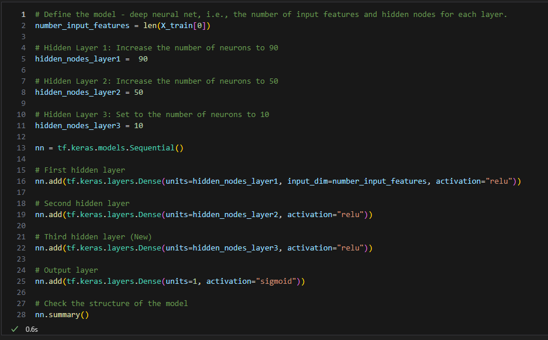
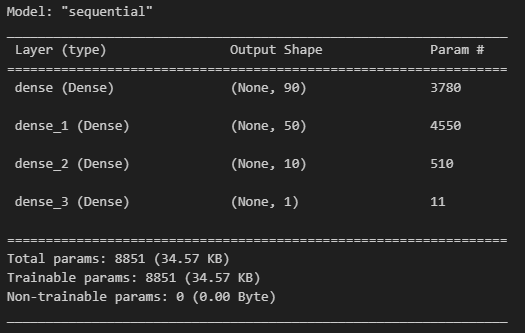
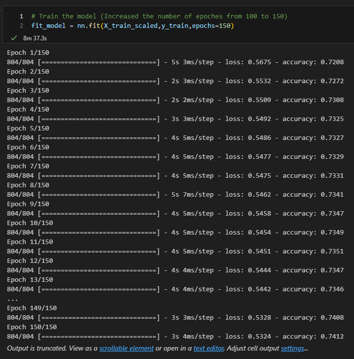
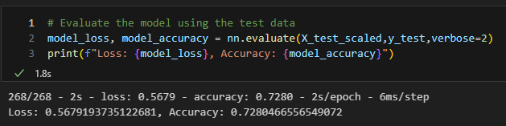

# Alphabet Soup Charity Analysis

## Overview of the Analysis
The purpose of this challenge was to use machine learning and neural networks to determine which applicants had the best chance of success if funded by the nonprofit foundation Alphabet Soup.  The dataset contained over 34,000 oragnizations that had received funding from Alphabet Soup and comrpised of: 
* EIN: Identification column
* NAME: Identification column
* APPLICATION_TYPE: Alphabet Soup application type
* AFFILIATION: Affiliated sector of industry
* CLASSIFICATION: Government organization classification
* USE_CASE: Use case for funding
* ORGANIZATION: Organization type
* STATUS: Active status
* INCOME_AMT: Income classification
* SPECIAL_CONSIDERATIONS: Special considerations for application
* ASK_AMT: Funding amount requested
* IS_SUCCESSFUL: Was the money used effectively
To complete this task, machine learning and neural networks were built to use the data above to determine whether or not the oragnizations were successful in their ventures.

## Results
Starter Model: , , 
Optimized Model: , , , 

* Data Preprocessing
    * Target Variables
        * IS_SUCCESSFUL
    * Feature Variables
        * APPLICATION_TYPE
        * AFFILIATION
        * CLASSIFICATION
        * USE_CASE
        * ORGANIZATION
        * STATUS
        * INCOME_AMT
        * SPECIAL_CONSIDERATIONS
        * ASK_AMT
    * Neither Target or Feature Variables
        * N/A

* Compiling, Training, and Evaluating the Model
    * The neural network was made up of 2 hidden layers and the output layer.  The hidden layers had 80 and 30 neurons and activation functions of all relu.  The reasoning for those decisions is that the number of neurons is 2-3 times the number of inputs and the activation function relu was the most straightforward, safe way to run the model.  Due to this safe start, the model did not reach the desired target model performance of 75%.  Attempts were made to increase model performance such as increasing the number of hidden layers (3 instead of 2), the number of neurons (layer 1: 90, layer 2: 50, layer 3: 10) and the number of epoches (150 instead of 100).  These attempts, however, had proven to make little difference in the increasing model performance.

## Summary
The overall results of the deep learning model were not satisfactory.  Although the neural network produced about 73%, it still fell short of the bar of 75% performance even with all of the binning of rare values in the categorical features to the changing the number of neurons, layers, and epoches as stated in the results section.  After viewing the results of this challenge, it seems that it was necessary to use a different model to solve this problem such as logistic regression with adjusting the training split data if necessary as it is very easy to interpret or stick with neural networks but use leaky relu or tanh activation function as relu is not the solution to every model.